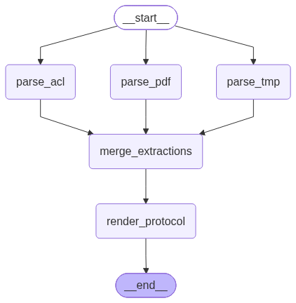

# Solution — Cell Qualification Protocol (CQP) Generator

This repository contains an automated service to ingest cell battery testing and datasheet files and compile a polished, dynamic **Cell Qualification Protocol (CQP)** document.

## How to Run

Follow these steps to run the application on your local machine:

### 1. Prerequisites
Ensure you have Python 3.12+ installed.

### 2. Setup Virtual Environment & Install Dependencies
Initialize your virtual environment (e.g., using `uv` or standard `venv`) and install the required libraries:

```powershell
# Using uv (Recommended)
uv venv
uv pip install -r requirements.txt

# Or using standard pip
python -m venv .venv
.venv\Scripts\activate
pip install -r requirements.txt
```

*(If you don't have `uv` installed, standard python pip installs everything in under a minute).*

### 3. Setup Configuration Key
Make sure a `.env` file exists in the root folder of this project with your key:
```env
NVIDIA_API_KEY="your-nvidia-integration-api-key"
```

### 4. Run the Streamlit Interface
Start the local web application:
```powershell
.venv\Scripts\python.exe -m streamlit run main.py
```
This will start the local server and open your browser to `http://localhost:8501`.

---

## System Architecture

The tool is divided into a modular, concurrent ingestion backend and a modern web interface:

```
[Web UI (main.py)]
      │
      ▼
[LangGraph Workflow (app/graph.py)]
      │
      ├─► [parse_pdf_node] ────► extract_pdf_data (app/pdf_parser.py) ──► ChatNVIDIA (step-3.7-flash)
      ├─► [parse_tmp_node] ────► parse_tmp_document (app/doc_parsers.py)
      └─► [parse_acl_node] ────► parse_acl_document (app/doc_parsers.py)
      │
      ▼
[merge_extractions_node]
      │
      ▼
[render_protocol_node] ──► render_protocol_docx (app/docx_editor.py) ──► Output CQP.docx
```


### 1. Ingestion State Graph (`app/graph.py`)
We orchestrate the document extraction phase using **LangGraph** (with full state mapping). It is designed as a fan-out / fan-in parallel pipeline:
* **`parse_pdf` Node:** Extracts images from PDF pages and sends them along with extracted native text to `stepfun-ai/step-3.7-flash` via LangChain's `ChatNVIDIA` endpoint.
* **`parse_tmp` Node:** Parses the Test Method Procedure `.docx` structure.
* **`parse_acl` Node:** Parses the Acceptance Criteria & Limits `.docx` tables and note structures.
* **`merge_extractions` Node:** Joins all results and constructs a unified state dictionary.
* **`render_protocol` Node:** Customizes the Word template.

### 2. Templating & XML Document Engineering (`app/docx_editor.py`)
To preserve layout format, fonts, borders, header/footer text, and cell margins, we modify the XML trees directly using python-docx helpers:
* **Table 1 Matrix:** Dynamically clones rows, replaces tokens, and merges the `Duty Profile` cell vertically using `<w:vMerge w:val="restart"/>` and `<w:vMerge/>`.
* **Section 7 repeated blocks:** Clones the repeated block of 6 elements (Heading 2, table, and paragraphs) in order. It removes original placeholder blocks and inserts $N$ copies while resolving profile-specific limit cells and footnote tables.
* **Exceptions Locking:** Wraps reviewer zone paragraphs in XML exception tags (`<w:permStart w:edit="everyone" />` / `<w:permEnd />`) and locks everything else as read-only via settings documentProtection.

---

## Core Assumptions & Known Failure Modes

We engineered this system to be highly resilient, but we documented the following constraints:

### 1. External Vision API Latency
* **Assumption:** The NVIDIA endpoint is available and responsive.
* **Failure Mode:** If the connection drops or the integrate proxy experiences heavy load, model calls may time out. We configured a `timeout=120` inside the `ChatNVIDIA` model arguments to tolerate api delays.

### 2. Document Layout Formatting Changes
* **Assumption:** The input ACL files organize tables directly under `Duty Profile:` header paragraphs.
* **Failure Mode:** If a future ACL document completely restructures how profiles are written (e.g. putting tables under tabs, or merging multiple profiles into a single table), the parsing order scanner might miss table boundaries.

### 3. Document Protection Password
* **Assumption:** Word read-only protection without password lock is sufficient to guide reviewer input.
* **Failure Mode:** Standard Word protection without hash code can be easily unlocked by clicking "Stop Protection" in Word. (We did not set a password hash as none was specified in the gold).
